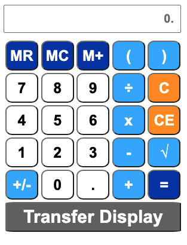

# GRE Calculator Extension

The GRE Calculator Extension is a simple calculator designed for users preparing for the GRE exam. It allows users to perform basic arithmetic calculations and includes memory functions to store and recall values. The extension is available for use in the Google Chrome browser.

## Features

- Basic arithmetic operations: addition, subtraction, multiplication, and division.
- Memory functions: MR (Memory Recall), MC (Memory Clear), and M+ (Memory Sum).
- Square root calculation: Calculate the square root of a number.
- Change sign: Change the sign of the displayed number (positive to negative or vice versa).
- Error handling: Properly handles errors and displays "Error" when necessary.
- Transfer display: Allows copying the current display value to the clipboard.

## Installation

Follow these steps to install and use the GRE Calculator extension in your Google Chrome browser:

1. Clone the repository to your local machine using Git or download it as a ZIP archive.

2. Open Google Chrome and type `chrome://extensions/` in the address bar.

3. Enable "Developer mode" by toggling the switch in the top right corner.

4. Click on the "Load unpacked" button in the top left corner.

5. Select the folder where you cloned or extracted the repository containing the extension files (manifest.json, popup.html, popup.css, and popup.js).

6. The GRE Calculator extension should now be loaded and visible in your extensions list.

## How to Use

1. Click on the extension icon in the Google Chrome toolbar to open the calculator.

2. The calculator will display an input field at the top where you can see and perform calculations.

3. Use the calculator buttons to enter numbers, perform calculations, and use memory functions.

4. To perform a calculation, click the appropriate number buttons and operator buttons (+, -, *, /), and then click the "=" button to get the result.

5. To calculate the square root of a number, enter the number and click the "√" button.

6. To change the sign of the displayed number, click the "+/-" button.

7. The "C" button clears the entire display, while the "CE" button clears the last entry.

8. The memory functions are as follows:
   - "MR" (Memory Recall): Appends the value stored in memory to the current display.
   - "MC" (Memory Clear): Clears the value stored in memory.
   - "M+" (Memory Sum): Adds the current display value to the value stored in memory.

9. To copy the current display value to the clipboard, click the "Transfer Display" button.

10. The calculator will handle errors gracefully and display "Error" if an invalid operation is performed.

## Contributing

If you encounter any issues or have suggestions for improvements, feel free to open an issue or submit a pull request in the GitHub repository.

## License

This GRE Calculator extension is licensed under the [MIT License](LICENSE).

---

Thank you for using the GRE Calculator Extension! If you find it helpful, consider giving it a ⭐ on GitHub. If you have any questions or need further assistance, please don't hesitate to reach out. Happy calculating! 🧮